# ShellEngine 패스 기반 렌더링 구조

## 개요

ShellEngine의 렌더링은 `RenderData`가 정의한 뷰/타겟 단위 작업을 `ScriptableRenderer`가 패스 목록으로 풀고, 각 `ScriptableRenderPass`가 자신의 리소스 사용 의도를 선언한 뒤, 백엔드 `CommandBuffer`가 실제 Vulkan 커맨드로 기록하는 구조입니다.

| 계층 | 책임 |
|---|---|
| `Renderer` | 렌더 스레드 진입점, drawable/render data 큐 반영, 커맨드 제출 조율 |
| `RenderDataManager` | 카메라/뷰 데이터를 GPU 버퍼에 업로드하고 `RenderData`를 priority 순으로 정렬 |
| `ScriptableRenderer` | 활성 패스 선택, render queue 정렬, 리소스 전이 계산, 패스별 커맨드 버퍼 기록 |
| `ScriptableRenderPass` | 패스 이름, render queue, 렌더 타겟/샘플링 텍스처 사용 의도, 드로우 기록 |
| `CommandBuffer` | 배리어, 렌더 타겟 설정, draw/dispatch/blit 같은 백엔드 독립 커맨드 인터페이스 |
| Vulkan 구현 계층 | `CommandBuffer` 호출을 dynamic rendering, pipeline bind, descriptor bind, barrier 호출로 변환 |

핵심은 패스가 “무엇을 렌더링하고 어떤 이미지를 읽고 쓰는지”만 표현하고, 이미지 레이아웃 전이와 Vulkan 동기화 코드는 `ScriptableRenderer`와 `VulkanCommandBuffer`가 처리한다는 점입니다.

## 프레임 흐름

1. 게임/에디터 쪽에서 `Renderer::PushDrawAble()`과 `Renderer::PushRenderData()`로 렌더링할 객체와 뷰 정보를 큐에 넣습니다.
2. 렌더 스레드의 `Renderer::Render()`가 큐를 비우고 `RenderDataManager::UploadToGPU()`를 호출합니다.
3. `RenderDataManager`는 각 `RenderViewer`의 view/proj/camera position을 GPU 버퍼에 업로드하고 `RenderData`를 `priority` 기준으로 정렬합니다.
4. `VulkanRenderer::Render()`가 스왑체인 이미지를 획득한 뒤 각 `RenderData`에 frame index와 drawable 목록을 연결합니다.
5. `ScriptableRenderer::Setup()`이 해당 `RenderData`에서 사용할 패스를 활성화합니다.
6. `ScriptableRenderer::Execute()`가 활성 패스를 `RenderQueue` 순으로 정렬하고, 각 패스의 `Configure()`를 호출해 리소스 사용 정보를 확정합니다.
7. 렌더러가 `BarrierInfo`를 계산한 뒤, 각 패스의 커맨드 버퍼 기록을 스레드 풀 task로 분배합니다.
8. 모든 패스 커맨드 기록이 끝나면 `VulkanRenderer`가 기록된 커맨드들을 순서대로 제출하고 마지막 커맨드가 present semaphore를 signal합니다.
9. 마지막에 `ExecuteTransfer()`가 readback/copy 작업을 위한 `CopyPass`를 기록하고, 스왑체인을 `Present` 상태로 전이합니다.

```mermaid
flowchart TD
    A["Game/Editor Thread"] --> B["Renderer::PushDrawAble()\nRenderer::PushRenderData()"]
    B --> C["Render thread\nRenderer::Render()"]
    C --> D["DrainRenderCommands()\ndrawable/render data queue 반영"]
    D --> E["RenderDataManager::UploadToGPU()"]
    E --> F["RenderViewer camera buffer 업로드\nRenderData priority 정렬"]
    F --> G["VulkanRenderer::Render()"]
    G --> H["vkAcquireNextImageKHR()\nframe index 획득"]
    H --> I["RenderData에 frame index와\ndrawable list 연결"]
    I --> J["ScriptableRenderer::Setup()"]
    J --> K["RenderData::tag 기준\n활성 패스 enqueue"]
    K --> L["ScriptableRenderer::Execute()"]
    L --> M["RenderQueue 정렬"]
    M --> N["각 패스 Configure()\nRenderTexture 사용 의도 확정"]
    N --> O["BuildBarrierInfo()\nBarrierInfo 계산"]
    O --> P{"ThreadPool\n패스별 병렬 기록"}
    P --> Q["CommandBuffer::Begin()"]
    Q --> R["CommandBuffer::EmitBarrier()"]
    R --> S["ScriptableRenderPass::Record()"]
    S --> T["CommandBuffer::End()"]
    T --> U["recordedCmds에 순서대로 수집"]
    U --> V["VulkanQueueManager::Submit()\n커맨드 순차 제출"]
    V --> W["ExecuteTransfer()\nCopyPass/readback 기록"]
    W --> X["swapchain -> Present 전이"]
    X --> Y["vkQueuePresentKHR()"]
    Y --> Z["CallReadbacks()\nResetSubmittedCommands()"]
```



## RenderData와 RenderViewer

`RenderData`는 한 번의 렌더링 작업이 사용할 뷰어, 렌더 타겟, 태그, 우선순위를 담습니다.

```cpp
class RenderData
{
public:
    void SetRenderTarget(const RenderTexture* renderTarget);
    void SetRenderTargets(std::initializer_list<const RenderTexture*> renderTargets);
    void ClearRenderTargets();

    int priority = 0;
    core::Name tag{ "Camera" };
    std::vector<RenderViewer> renderViewers;
};
```

`RenderViewer`는 view/proj 행렬, 카메라 위치/방향, viewport/scissor, GPU camera buffer offset을 가집니다. `RenderDataManager`는 각 viewer마다 `RenderDataManager::BufferData`를 업로드하고, 그 offset을 `RenderViewer::offset`에 기록합니다. Vulkan draw 단계에서는 이 offset이 카메라 descriptor set의 dynamic offset으로 전달됩니다.

최근 구조에서는 `RenderData`가 여러 렌더 타겟을 가질 수 있습니다.

- `SetRenderTarget()`은 단일 타겟용 편의 함수입니다.
- `SetRenderTargets()`는 MRT를 구성합니다.
- 타겟이 `nullptr`이면 현재 스왑체인 이미지를 의미합니다.
- depth 전용 `RenderTexture`는 color attachment가 아니라 depth attachment로 취급됩니다.

## 기본 패스 구성

`GameRenderer::Init()`은 기본 패스를 생성하고, `GameRenderer::Setup()`은 `RenderData::tag`에 따라 필요한 패스만 enqueue합니다.

| 태그 | 실행 패스 |
|---|---|
| `"Depth"` | `DepthPass` |
| `"SSAO"` | `SSAOPass` |
| `"Combine"` | `CombinePass` |
| `"ImGUI"` | `GUIPass` |
| 그 외 카메라 | `Opaque`, `Transparent`, `UI` |

현재 기본 패스의 역할은 다음과 같습니다.

| 패스 | Queue | 역할 |
|---|---|---|
| `DepthPass` | `BeforeRendering` | depth/shadow 계열 렌더링. depth 전용 타겟도 지원 |
| `Opaque` | `Opaque` | 기본 불투명 렌더링 |
| `SSAOPass` | `AfterOpaque` | 풀스크린 plane으로 depth 등을 샘플링해 AO 타겟에 기록 |
| `CombinePass` | `AfterRendering` | 풀스크린 plane으로 AO 등 후처리 결과를 최종 타겟에 합성 |
| `Transparent` | `Transparent` | 카메라 방향 기준 back-to-front 정렬 후 개별 draw |
| `UI` | `Transparent` | UI shader pass용 transparent pass |
| `GUIPass` | `UI` | ImGui draw data 기록 |
| `CopyPass` | `AfterRendering` | readback/copy transfer 전용 내부 패스 |

`SSAOPass`와 `CombinePass`는 패스 내부에서 fullscreen plane `Mesh`와 `Drawable`을 보유하고, 외부에서 `SetMaterial()`로 지정한 material을 사용합니다. 두 패스 모두 material이 참조하는 `RenderTexture`를 `Configure()`에서 샘플링 리소스로 등록합니다.

## ScriptableRenderPass

패스는 `passName`과 `renderQueue`를 갖고, 크게 두 단계로 동작합니다.

### Configure

`Configure(const RenderData&)`는 커맨드 기록 전에 리소스 사용 의도를 확정합니다.

- 기본 구현은 현재 `passName`을 가진 shader pass가 있는 drawable만 `RenderBatch`로 묶습니다.
- `SetRenderTargetImageUsages()`가 `RenderData::GetRenderTargets()`를 순회해 color/depth attachment 사용을 등록합니다.
- `SetImageUsages()`가 drawable/material의 `MaterialData::CachedRT`를 확인해 샘플링하는 `RenderTexture`를 등록합니다.
- depth texture를 샘플링하는 경우 `DepthStencilSampledRead`, 일반 texture는 `SampledRead`로 등록합니다.

예전 문서의 `BuildDrawList()` 단계는 현재 `CreateRenderBatch()`와 `Configure()` 흐름으로 대체되었습니다.

### Record

`Record(CommandBuffer&, const IRenderContext&, const RenderData&)`는 실제 커맨드를 기록합니다.

- 기본 구현은 `cmd.SetRenderData(renderData, true, true, true, true)`로 렌더링을 시작합니다.
- viewer마다 viewport/scissor를 설정합니다.
- `RenderBatch` 단위로 `cmd.DrawMeshBatch()`를 호출합니다.
- `TransparentPass`처럼 정렬이 필요한 패스는 batch 대신 개별 `DrawMesh()`를 호출할 수 있습니다.
- 풀스크린 후처리 패스는 내부 drawable 하나를 직접 그립니다.

## 리소스 전이

패스는 직접 Vulkan barrier를 만들지 않습니다. 대신 `renderTextures`에 “이번 패스에서 이 이미지를 어떤 용도로 쓸 것인지”를 기록합니다.

```cpp
enum class ResourceUsage
{
    Undefined,
    ColorAttachment,
    SampledRead,
    Present,
    TransferSrc,
    DepthStencilAttachment,
    DepthStencilSampledRead
};
```

`ScriptableRenderer::BuildBarrierInfo()`는 각 패스의 `renderTextures`를 보고 이전 사용 상태와 현재 사용 상태를 `BarrierInfo`로 만듭니다.

| 대상 | 이전 상태 출처 |
|---|---|
| `RenderTexture*` | `RenderTexture::GetUsage()` |
| `nullptr` 스왑체인 | `ScriptableRenderer::swapChainStates[frameIndex]` |

계산된 `BarrierInfo`는 해당 패스 커맨드 버퍼 시작 직후 `cmd.EmitBarrier()`로 기록됩니다. Vulkan에서는 `VulkanCommandBuffer::EmitBarrier()`가 `ResourceUsage`를 image layout, pipeline stage, access mask로 매핑하고 `VulkanImageBuffer::BarrierCommand()`를 호출합니다.

예시 흐름:

```text
depth texture   Undefined              -> DepthStencilAttachment
depth texture   DepthStencilAttachment -> DepthStencilSampledRead
ao texture      Undefined              -> ColorAttachment
ao texture      ColorAttachment        -> SampledRead
swapchain       Undefined              -> ColorAttachment
readback src    ColorAttachment        -> TransferSrc
swapchain       ColorAttachment        -> Present
```

## 멀티스레딩

`ScriptableRenderer::Execute()`는 리소스 전이를 먼저 직렬로 계산한 뒤, 각 패스의 커맨드 버퍼 기록을 스레드 풀에 task로 분배합니다.

직렬 단계:

- 활성 패스 정렬
- 모든 패스 `Configure()`
- 모든 패스 `BarrierInfo` 계산

병렬 단계:

- 패스별 `CommandBuffer` 할당
- `Begin()`
- `EmitBarrier()`
- `Record()`
- `End()`

커맨드 버퍼 기록은 병렬이지만, 제출은 `recordedCmds` 순서대로 수행됩니다. 따라서 패스 간 이미지 상태 전이는 정렬된 패스 순서를 기준으로 안정적으로 계산되고, 실제 제출 순서도 그 순서를 유지합니다.

## Vulkan 구현

`VulkanCommandBuffer`는 현재 Vulkan dynamic rendering을 사용합니다.

- `SetRenderData()`가 `RenderData::GetRenderTargets()`로 `VkRenderingAttachmentInfoKHR` 배열을 구성합니다.
- 여러 color attachment를 지원하며, 첫 번째 타겟 또는 depth 전용 타겟에서 depth attachment를 가져옵니다.
- 스왑체인 렌더링에서는 `nullptr` 타겟을 swapchain image로 해석합니다.
- MSAA 타겟이 있으면 color attachment에 MSAA image를 사용하고 resolve image를 원본 color image로 지정합니다.
- `RenderTargetLayout`은 color format 목록, depth format, MSAA 여부를 담고 pipeline cache key로 사용됩니다.

draw 단계에서는 shader pass 이름으로 material의 `ShaderPass` 목록을 찾고, topology/skinned 여부/render target layout에 맞는 pipeline을 가져옵니다. descriptor set은 usage 기준으로 다음처럼 바인딩됩니다.

| Set usage | 데이터 |
|---|---|
| `Camera` | `RenderDataManager` GPU buffer, dynamic offset 사용 |
| `Object` | drawable별 material data |
| `Material` | material별 uniform/texture data |

Shader DSL에서 `MATRIX_VIEW`, `MATRIX_PROJ`, `CAMERA`를 사용하면 parser가 `CAMERA` uniform buffer를 자동으로 구성합니다. 현재 camera buffer는 `view`, `proj`, `pos`를 담고, `MATRIX_VIEW`와 `MATRIX_PROJ`는 각각 `CAMERA.view`, `CAMERA.proj`로 치환됩니다.

## MaterialData와 텍스처 추적

렌더 텍스처 샘플링 추적은 `MaterialData`의 `CachedRT`에 저장됩니다.

```cpp
struct CachedRT
{
    uint32_t set = 0;
    uint32_t binding = 0;
    core::SObjWeakPtr<const ShaderPass> pass;
    core::SObjWeakPtr<const RenderTexture> rt;
};
```

패스의 `Configure()`는 material/drawable이 가진 cached render texture 중 현재 `passName`과 lighting pass 이름이 같은 항목만 읽기 리소스로 등록합니다. 이 구조 덕분에 후처리 material이 depth, SSAO, color texture를 참조하더라도 패스 쪽에서 별도 barrier 코드를 직접 작성하지 않아도 됩니다.

## 패스 추가 방법

새 패스를 추가할 때는 다음 순서로 작업합니다.

1. `ScriptableRenderPass`를 상속한 클래스를 만든다.
2. 생성자에서 `passName`과 `RenderQueue`를 정한다.
3. 기본 batch 드로우면 기본 `Configure()`를 쓰고, 풀스크린/특수 패스면 `Configure()`에서 `SetRenderTargetImageUsages()`와 `SetImageUsages()`를 직접 호출한다.
4. `Record()`에서 `CommandBuffer` API로 렌더 타겟 설정, viewport/scissor, draw/dispatch/blit을 기록한다.
5. `ScriptableRenderer` 파생 클래스의 `Init()`에서 `AddRenderPass<T>()`로 생성한다.
6. `Setup()`에서 `RenderData::tag`나 상황에 맞춰 `EnqueRenderPass()` 한다.

예시:

```cpp
class MyPostPass : public ScriptableRenderPass
{
public:
    MyPostPass(const IRenderContext& ctx)
        : ScriptableRenderPass(core::Name{ "MyPostPass" }, RenderQueue::AfterRendering),
          ctx(ctx)
    {
    }

protected:
    void Configure(const RenderData& renderData) override
    {
        renderTextures.clear();
        SetRenderTargetImageUsages(renderData);
        SetImageUsages(*material);
    }

    void Record(CommandBuffer& cmd, const IRenderContext& ctx, const RenderData& renderData) override
    {
        cmd.SetRenderData(renderData, false, false, true, false);
        for (std::size_t i = 0; i < renderData.renderViewers.size(); ++i)
        {
            SetViewportScissor(cmd, ctx, renderData.renderViewers[i]);
            cmd.DrawMesh(*fullscreenDrawable, passName, i);
        }
    }

private:
    const IRenderContext& ctx;
    Material* material = nullptr;
    Drawable* fullscreenDrawable = nullptr;
};
```
